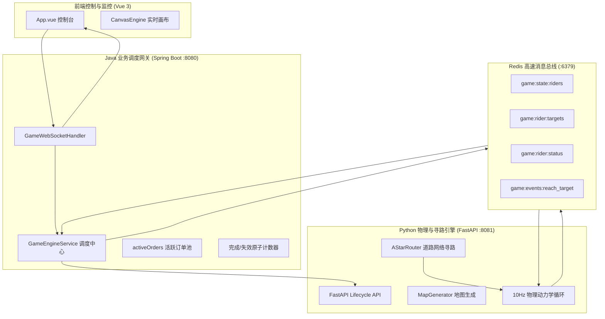
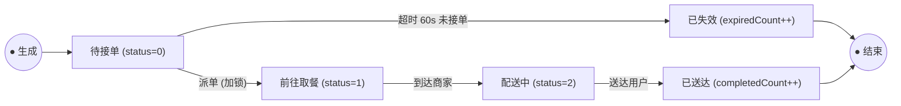

# 🚀 外卖调度系统后端运行规则与架构设计文档 (Meileme Backend)

本文档详细描述了本项目后端的完整架构设计、服务分工、物理寻路逻辑、业务调度状态机、生命周期控制及 Redis 交互协议。

---

## 📌 一、 整体架构总览

系统采用 **“Java 业务调度网关 + Python 物理模拟与 A\* 寻路 + Redis 消息总线 + Vue 3 实时监控前端”** 的高性能微服务协同架构。



---

## 🗺️ 二、 城市地图与临路规则

地图为一个 **201 × 201** 的逻辑网格（坐标范围 `-100` 至 `+100`），由 `MapGenerator` 动态生成。

### 1. 道路层级与车速规范
城市道路由交错的网格线构成，不同道路等级赋予不同的通行速度与 A\* 权值：
| 道路类型 | 枚举值 | 宽度 | 骑手移动速度 | 导航优先级 / 代价 |
| :--- | :---: | :---: | :---: | :--- |
| **主干道 (Main Road)** | `1` | 3 格宽 | **9.0 格/秒** | 最高优先级（单位通行耗时最短） |
| **大路 (Big Road)** | `2` | 2 格宽 | **6.5 格/秒** | 次高优先级 |
| **小路 (Small Road)** | `3` | 1 格宽 | **4.0 格/秒** | 基础连接路 |

### 2. 临路可达性保证（Roadside Placement）
为了确保骑手在**纯道路网络中 100% 能够连通到达**，杜绝不可达孤岛：
- **商家（Merchant）**：在商业区（`TILE_COM_LOW` / `TILE_COM_HIGH`）中筛选所有**与马路 4-邻域相邻**的格子进行随机放置。取餐停靠点直接对接该相邻道路格子。
- **送餐点（Delivery Point）**：自动提取全部 **3800+ 个与马路 4-邻域相邻的住宅区格子**（`residentialCells`）。Java 每次生成新订单时直接从该临路池中选取。
- **骑手出生点**：初始出生在主干道十字中心 `(0, 0)`。

---

## 🚴 三、 Python 物理模拟与 A* 寻路引擎

Python 模块运行在 **8081** 端口，提供基于 FastAPI 的生命周期接口和 10Hz 的物理循环。

### 1. 道路网络 A* 寻路 (`pathfinding.py`)
- **状态空间约束**：骑手只允许在马路格子（`tile in (1, 2, 3)`）上移动，禁止越界穿越建筑物。
- **代价函数与启发式**：
  $$cost(u, v) = \frac{1.0}{speed(v)}$$
  $$h(n) = \frac{\text{ManhattanDistance}(n, target)}{\text{MaxSpeed}(9.0)}$$
  寻路器自动偏好通行速度更快的高等级道路（主干道 > 大路 > 小路）。
- **拐点压缩（Waypoints）**：自动将长直道中间点压缩为关键转弯点，输出精简路点序列。

### 2. 物理运动与动态变速 (`engine.py`)
- 物理引擎以 **10Hz (100ms/tick)** 周期运行。
- 每个 tick 骑手根据当前所在格子的道路类型**动态调整瞬时速度**：
  $$\text{speed} = \text{RoadSpeeds}[\text{currentTile}]$$
- 沿航点序列逐段前进：
  - 若一步位移跨越拐点，自动转向并消耗下一个拐点。
  - 到达最终目标（距离 $< 0.05$）时，清空当前目标并向 Redis 的 `game:events:reach_target` 队列推送到达事件。

---

## ☕ 四、 Java 业务调度与生命周期规则

Java 模块基于 Spring Boot 运行在 **8080** 端口，是系统的业务控制中枢与 WebSocket 网关。

### 1. 动态生命周期管理
系统默认处于静默等待状态，必须通过前端配置参数后启动：
- **`START_SIMULATION` (启动)**：
  1. 接收前端传入的 `merchantCount`（商家数）和 `riderCount`（骑手数）。
  2. 调用 Python `POST /api/simulation/start` 动态初始化地图并启动 10Hz 物理引擎。
  3. 清空活跃订单列表、骑手占用锁，并将 `completedOrderCount` 和 `expiredOrderCount` 计数器归零。
  4. 重置虚拟时钟为 **2026年07月01日 00:00:00**，设置 `isRunning = true, isPaused = false`，开启各项定时调度任务并广播 `SIMULATION_STARTED`。
- **`PAUSE_SIMULATION` (暂停)**：
  1. 设置 `isPaused = true`，阻断订单生成、派单与超时计算。
  2. 调用 Python `POST /api/simulation/pause`，使物理引擎暂停计算，骑手瞬间定格在马路当前坐标。
  3. 向所有客户端广播 `SIMULATION_PAUSED`，前端虚拟时钟与订单流定格。
- **`RESUME_SIMULATION` (继续)**：
  1. 设置 `isPaused = false`，恢复业务调度。
  2. 调用 Python `POST /api/simulation/resume`，恢复物理引擎动力学更新。
  3. 向所有客户端广播 `SIMULATION_RESUMED`，前端时钟继续流逝。
- **`STOP_SIMULATION` (结束并重置)**：
  1. 设置 `isRunning = false, isPaused = false`，立即阻断所有订单生成与派单调度。
  2. 调用 Python `POST /api/simulation/stop` 停止物理 Tick 线程并清空 Redis 键。
  3. 清空所有内存活跃数据与计数器，向所有客户端广播 `SIMULATION_STOPPED`。

### 2. 游戏虚拟时间系统 (Game Virtual Time)
- **起始基准时间**：**2026年07月01日 00:00:00**
- **时间加速倍率**：**120 倍**（现实 **1 秒** = 游戏 **2 分钟**；现实 30 秒 = 游戏 1 小时；现实 12 分钟 = 游戏 1 整天）。
- **流速控制**：仅在模拟处于“运行中”且“非暂停”状态下推进时间，暂停时时钟绝对定格，重置时归零。

### 3. 订单生命周期与超时失效状态机


### 4. 商家综合评分数学模型与出单机制
系统建立了真实拟真的**商家动态评分与订单引流模型**：

#### (1) 商家评分模型 $(0, 5.0]$
每送达一单，系统自动核算本单综合体验分，并平滑更新商家评分：
- **配送时效分 $S_{delivery} \in [1.0, 5.0]$**（根据送达耗时 $T = (\text{now} - \text{createTime})/1000$ 秒）：
  $$S_{delivery} = \begin{cases} 
  5.0 & T \le 15\text{s} \\
  5.0 - \frac{T - 15}{15} \times 1.0 & 15\text{s} < T \le 30\text{s} \\
  4.0 - \frac{T - 30}{30} \times 2.0 & 30\text{s} < T \le 60\text{s} \\
  1.0 & T > 60\text{s}
  \end{cases}$$
- **餐品质量分 $S_{quality} \in [1.0, 5.0]$**：顾客对食物口味的随机打分（90% 概率落入 $[3.5, 5.0]$，10% 概率为偶然差评 $[1.0, 3.0]$）。
- **单单综合得分**：$S_{order} = 0.4 \times S_{delivery} + 0.6 \times S_{quality}$。
- **商家评分平滑迭代 (EMA)**：
  $$\text{Rating}_{new} = \text{round}(\text{Rating}_{old} \times 0.85 + S_{order} \times 0.15, 1)$$

#### (2) 商家数量与评分决定出单规则
系统以 **1 秒为周期** 扫描所有商家，商家 $i$ 在当前秒独立触发生成订单的概率为：
$$P_i = 0.15 \times \left(\frac{\text{Rating}_i}{5.0}\right)^2$$
- **多商家效应**：全图商家越多，每秒总订单生成量成正比放大（$N$ 个商家每秒期望出单 $0.15 \times N$ 单）。
- **高评分马太效应**：满分 5.0 商家平均 6.6 秒出 1 单；3.0 分商家平均 18.5 秒出 1 单，评分直接左右商家订单量。

### 5. 核心调度任务清单
| 调度任务 | 频率 | 核心规则 |
| :--- | :---: | :--- |
| **`generateOrder()`** | 1000ms | 遍历所有商家，根据商家当前评分概率产生订单，从临路住宅池随机选取送达点，更新商家进行中订单数并广播 `ORDER_CREATED` 与 `MERCHANT_UPDATE`。 |
| **`assignOrders()`** | 1000ms | **双重逻辑**：<br>1. **超时失效**：清理待接单超过 60 秒的订单，减少商家进行中单量，递增 `expiredOrderCount` 并广播 `ORDER_EXPIRED` 与 `MERCHANT_UPDATE`；<br>2. **就近派单**：为未接单订单寻找最近空闲骑手，加 `busyRiderIds` 并发锁，向 Redis 写入目标点，广播 `RIDER_ASSIGNED`。 |
| **`syncFromPython()`** | 100ms | 1. 从 Redis 读取骑手坐标广播 `RIDER_UPDATE`；<br>2. 从 `game:events:reach_target` 消费到达事件并流转订单状态；<br>3. 订单送达时触发 `updateMerchantRating` 更新评分并广播 `ORDER_COMPLETED` 与 `MERCHANT_UPDATE`。 |

---

## 📡 五、 Redis 数据契约与交互字典

| Redis Key | 数据结构 | 生产者 | 消费者 | 作用与格式 |
| :--- | :---: | :---: | :---: | :--- |
| `game:state:riders` | String (JSON) | Python | Java | 骑手列表快照 `[{"id":"rider-001","currentPosition":{x,y},"speed":9.0,"status":1},...]` |
| `game:rider:targets` | Hash | Java | Python | 骑手目标点坐标 Hash，Field 为 `riderId`，Value 为 `{"x":...,"y":...}` 或 `"null"` |
| `game:rider:status` | Hash | Java | Python | 骑手业务状态 Hash：`0` 空闲、`1` 取餐中、`2` 送餐中 |
| `game:rider:orders` | Hash | Java | Python | 骑手当前绑定的订单 ID |
| `game:events:reach_target` | List (Queue) | Python | Java | 到达事件队列，元素为 `{"riderId":..., "orderId":..., "status":...}` |

---

## 💻 六、 前端控制台三页签与内存保护

为了提供清晰的操作视野并保障系统 **7 × 24 小时长时间运行无掉帧**：
1. **控制面板三页签切换 (Tabs)**：
   - 🏢 **商家列表**：实时展示每个商家的当前综合评分（⭐）、进行中订单数、已完成订单数和坐标。
   - 📦 **订单列表**：展示进行中的实时活跃订单流、取餐/送达坐标与状态徽章。
   - 🚴 **骑手列表**：实时展示所有骑手的物理坐标、当前目标与承接订单。
2. **内存与 DOM 节点即时释放**：前端收到 `ORDER_COMPLETED` 或 `ORDER_EXPIRED` 事件时，**立即执行 `delete orders.value[id]` 彻底从响应式字典中移除**，DOM 节点维持在极低数量。
3. **8 宫格实时状态指标**：
   - 🟢 空闲骑手 / 🟡 取餐中骑手 / 🟣 送餐中骑手
   - 🔴 待处理订单 / 🟡 待取餐订单 / 🟣 配送中订单
   - 🏆 **已送达订单数**（累计成功单量）
   - ⚠️ **已失效订单数**（累计超时单量）

---

## 🛠️ 七、 快速启动指南

### 1. 启动 Redis
```bash
redis-server
```

### 2. 启动 Python 物理引擎
```bash
cd backendpython
source venv/bin/activate
python main.py
```

### 3. 启动 Java 调度网关
```bash
cd backendjava
mvn spring-boot:run
```

### 4. 启动前端 Web 界面
```bash
cd frontendweb
npm run dev
```

在浏览器打开 `http://localhost:5173`，输入商家数与骑手数，点击 **【启动引擎】** 即可体验完整的真实路网外卖调度模拟！
