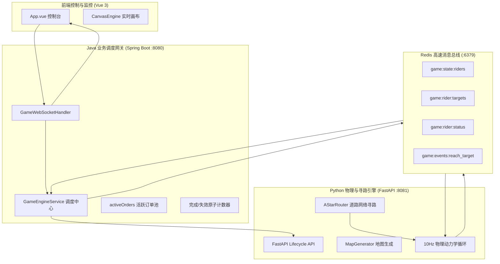
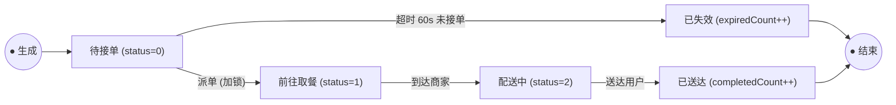
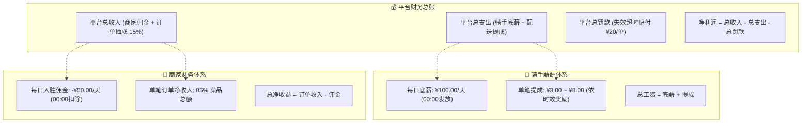

# 🚀 外卖调度系统后端运行规则与架构设计文档 (Meileme Backend)

本文档详细描述了本项目后端的完整架构设计、服务分工、物理寻路逻辑、业务调度状态机、生命周期控制及 Redis 交互协议。

---

## 📌 一、 整体架构总览

系统采用 **“Java 业务调度网关 + Python 物理模拟与 A\* 寻路 + Redis 消息总线 + Vue 3 实时监控前端”** 的高性能微服务协同架构。



---

## 🗺️ 二、 城市地图与随机路网规则

地图为一个 **201 × 201** 的逻辑网格（坐标范围 `-100` 至 `+100`），每次启动模拟时由 `MapGenerator` **完全动态随机生成**。

### 1. 全局统一色彩视觉标准
地图编辑器与游戏监控页面均严格遵循统一的色彩视觉规范：

| 实体分类 | 对象 / 状态 | 标准颜色 | 色值 Hex | 说明 |
| :--- | :--- | :---: | :---: | :--- |
| **道路层级** | **主干道 (Main Road)** | ⬜ **白色** | `#ffffff` | 最高车速 9.0 格/秒，3格宽 |
| | **大路 (Big Road)** | 🔘 **灰色** | `#94a3b8` | 次高车速 6.5 格/秒，2格宽 |
| | **小路 (Small Road)** | ⚫ **深灰色** | `#475569` | 基础车速 4.0 格/秒，1格宽 |
| **功能分区** | **高密度商业区** | 🟪 **深紫色** | `#6b21a8` | 产出商家取餐点 |
| | **低密度商业区** | 🟪 **浅紫色** | `#c084fc` | 产出商家取餐点 |
| | **高密度住宅区** | 🟩 **深绿色** | `#15803d` | 产出订单送餐目标 |
| | **低密度住宅区** | 🟩 **浅绿色** | `#86efac` | 基础基底，送餐目标 |
| **业务实体** | **商家 (Merchant)** | 🟧 **橘色** | `#f97316` | 地图取餐标记与评分卡片 |
| | **新订单 (New Order)** | 🟥 **红色** | `#ef4444` | 待接单状态 |
| **骑手状态** | **接单中 / 取餐中** | 🟦 **浅蓝色** | `#38bdf8` | 骑手正前往商家取餐 (Status 1) |
| | **配送中** | 🟦 **深蓝色** | `#1d4ed8` | 骑手正前往顾客送餐 (Status 2) |
| | **空闲** | 🟩 **绿色** | `#22c55e` | 骑手待命中 (Status 0) |

### 2. 临路可达性与骑手随机马路出生
为了确保骑手在纯道路网络中 **100% 能够连通到达**，杜绝不可达孤岛：
- **商家（Merchant）**：在商业区（`TILE_COM_LOW` / `TILE_COM_HIGH`）中严格筛选**与马路 8-邻域相邻**的格子进行放置。
- **送餐点（Delivery Point）**：自动提取全部**与马路 8-邻域相邻的住宅区格子**（`residentialCells`）。Java 每次生成新订单时直接从该临路池中选取。
- **骑手出生点（随机分散）**：启动时，骑手不再全部扎堆在同一中心点，而是在当前地图的所有道路格子（`road_set`）中**随机分散出生在马路上**。

### 3. 可视化地图编辑器与持久化存储 (Map Editor & CRUD)
系统提供了配套的**前端可视化地图编辑器**与**后端地图持久化 REST API**：
- **双绘制模式**：
  - 🖌️ **自由涂抹**：鼠标左键按住连续自由绘制道路或建筑区块。
  - 📏 **直线拉取**：按住鼠标拖拽拉取直线，画布呈现半透明高亮辅助线预览，松开鼠标自动以 Bresenham 算法将整条直线按照当前笔刷粗细（1/3/5格宽）一次性铺设到网格中，极大提升干道铺设效率。
- **历史撤销机制 (Undo)**：
  - 内存维护 30 步轻量网格快照栈，支持点击 **【↩️ 撤销】** 按钮或使用全局快捷键 **`Ctrl+Z` / `Cmd+Z`** 随时回退错误操作。
- **地图持久化目录**：`backendpython/saved_maps/{map_id}.json`。
- **REST 接口规范**：
  - `GET /api/maps`：获取所有已保存地图列表（名称、更新时间、道路数等元数据）。
  - `GET /api/maps/{map_id}`：获取指定地图的 201×201 完整网格数据。
  - `POST /api/maps`：新建并保存地图。
  - `PUT /api/maps/{map_id}`：修改覆盖已有地图。
  - `DELETE /api/maps/{map_id}`：删除指定地图。
- **启动地图选择**：启动模拟时支持选择自制地图或随机生成，系统自动解析并提取该自制地图的临路商家和送餐点。

---

## 🚴 三、 Python 物理模拟与 8 方向 A* 寻路引擎

Python 模块运行在 **8081** 端口，提供基于 FastAPI 的生命周期接口和 10Hz 的物理循环。

### 1. 8 方向（横、竖、斜）道路 A* 寻路 (`pathfinding.py`)
- **状态空间约束**：骑手只允许在马路格子（`tile in (1, 2, 3)`）上移动，禁止越界穿越建筑物。
- **8 方向移动与耗时代价**：
  - 直向移动（上下左右）：$\Delta d = 1.0, \text{cost} = \frac{1.0}{speed(v)}$
  - 斜向对角线移动：$\Delta d = \sqrt{2} \approx 1.414, \text{cost} = \frac{\sqrt{2}}{speed(v)}$
- **八方向 Octile 启发式函数**：
  $$h(n) = \frac{(\sqrt{2} - 1) \cdot \min(|dx|, |dy|) + \max(|dx|, |dy|)}{\text{MaxSpeed}(9.0)}$$
- **拐点压缩（Waypoints）**：自动对 8 个方向的同向直线进行拐点压缩，输出精简路点序列。

### 2. 物理运动与动态变速 (`engine.py`)
- 物理引擎以 **10Hz (100ms/tick)** 周期运行。
- 每个 tick 骑手根据当前所在格子的道路类型**动态调整瞬时速度**：
  $$\text{speed} = \text{RoadSpeeds}[\text{currentTile}]$$
- 沿 8 方向路点序列逐段匀速前进：
  - 若一步位移跨越拐点，自动转向并消耗下一个拐点。
  - 到达最终目标（距离 $< 0.05$）时，清空当前目标并向 Redis 的 `game:events:reach_target` 队列推送到达事件。

### 3. 空闲骑手主动寻热力巡游算法 (Idle Rider Relocation)
为了模拟真实外卖骑手“主动靠拢热点商圈待命”的行为，系统设计了基于**商圈订单期望热力与竞争抑制**的主动寻热巡游算法：
- **吸引力效用函数**：
  对于空闲骑手 $r$ 与商圈 $m$，其吸引力得分计算为：
  $$\text{Attractiveness}(r, m) = \frac{1.0}{\max(D(r, m), 2.0) \times (1.0 + 0.8 \times C_m)}$$
  其中 $D(r, m)$ 为骑手到商家的欧氏距离，$C_m$ 为当前已在该商圈周边 15 格内或正驶向该商圈的空闲骑手数量（**竞争惩罚因子**，防止全城骑手单一扎堆，自适应均衡全城运力）。
- **加权轮盘抽样与 A\* 巡航**：
  骑手根据各商圈吸引力权重进行加权随机抽样，选定目标商圈并在就近道路上巡游待命；
- **商圈路口驻留机制**：
  骑手巡游到达商圈后，在路口待命驻留 3~5 秒。若仍未接单，则再次评估并巡游至下一个潜力商圈；
- **即时无缝打断**：
  一旦 Java 调度层下发真实业务订单（Status 1），物理引擎立即中断巡游，清空巡游路径并瞬间无缝切换为订单取餐导航！

---

## ☕ 四、 Java 业务调度与生命周期规则

Java 模块基于 Spring Boot 运行在 **8080** 端口，是系统的业务控制中枢与 WebSocket 网关。

### 1. 动态生命周期管理
系统默认处于静默等待状态，必须通过前端配置参数后启动：
- **`START_SIMULATION` (启动)**：
  1. 接收前端传入的 `merchantCount`（商家数）、`riderCount`（骑手数）以及可选的 `mapId`（自制地图ID）。
  2. 调用 Python `POST /api/simulation/start` 加载指定地图（或随机生成）并启动 10Hz 物理引擎。
  3. 清空活跃订单列表、骑手占用锁，并将 `completedOrderCount` 和 `expiredOrderCount` 计数器归零。
  4. 重置虚拟时钟为 **2026年07月01日 00:00:00**，设置 `isRunning = true, isPaused = false`，开启各项定时调度任务并广播 `SIMULATION_STARTED`。
- **`PAUSE_SIMULATION` (暂停)**：
  1. 设置 `isPaused = true`，阻断订单生成、派单与超时计算。
  2. 调用 Python `POST /api/simulation/pause`，使物理引擎暂停计算，骑手瞬间定格在马路当前坐标。
  3. 向所有客户端广播 `SIMULATION_PAUSED`，前端虚拟时钟与订单流定格。
- **`RESUME_SIMULATION` (继续)**：
  1. 设置 `isPaused = false`，恢复业务调度。
  2. 调用 Python `POST /api/simulation/resume`，恢复物理引擎动力学更新。
  3. 向所有客户端广播 `SIMULATION_RESUMED`，前端时钟继续流逝。
- **`STOP_SIMULATION` (结束并重置)**：
  1. 设置 `isRunning = false, isPaused = false`，立即阻断所有订单生成与派单调度。
  2. 调用 Python `POST /api/simulation/stop` 停止物理 Tick 线程并清空 Redis 键。
  3. 清空所有内存活跃数据与计数器，向所有客户端广播 `SIMULATION_STOPPED`。

### 2. 游戏虚拟时间系统 (Game Virtual Time)
- **起始基准时间**：**2026年07月01日 00:00:00**
- **时间加速倍率**：**120 倍**（现实 **1 秒** = 游戏 **2 分钟**；现实 30 秒 = 游戏 1 小时；现实 12 分钟 = 游戏 1 整天）。
- **流速控制**：仅在模拟处于“运行中”且“非暂停”状态下推进时间，暂停时时钟绝对定格，重置时归零。

### 3. 订单生命周期与超时失效状态机
### 2. 物理运动与动态变速 (`engine.py`)
- 物理引擎以 **10Hz (100ms/tick)** 周期运行。
- 每个 tick 骑手根据当前所在格子的道路类型**动态调整瞬时速度**：
  $$\text{speed} = \text{RoadSpeeds}[\text{currentTile}]$$
- 沿 8 方向路点序列逐段匀速前进：
  - 若一步位移跨越拐点，自动转向并消耗下一个拐点。
  - 到达最终目标（距离 $< 0.05$）时，清空当前目标并向 Redis 的 `game:events:reach_target` 队列推送到达事件。

---

## ☕ 四、 Java 业务调度与生命周期规则

Java 模块基于 Spring Boot 运行在 **8080** 端口，是系统的业务控制中枢与 WebSocket 网关。

### 1. 动态生命周期管理
系统默认处于静默等待状态，必须通过前端配置参数后启动：
- **`START_SIMULATION` (启动)**：
  1. 接收前端传入的 `merchantCount`（商家数）和 `riderCount`（骑手数）。
  2. 调用 Python `POST /api/simulation/start` 动态初始化地图并启动 10Hz 物理引擎。
  3. 清空活跃订单列表、骑手占用锁，并将 `completedOrderCount` 和 `expiredOrderCount` 计数器归零。
  4. 重置虚拟时钟为 **2026年07月01日 00:00:00**，设置 `isRunning = true, isPaused = false`，开启各项定时调度任务并广播 `SIMULATION_STARTED`。
- **`PAUSE_SIMULATION` (暂停)**：
  1. 设置 `isPaused = true`，阻断订单生成、派单与超时计算。
  2. 调用 Python `POST /api/simulation/pause`，使物理引擎暂停计算，骑手瞬间定格在马路当前坐标。
  3. 向所有客户端广播 `SIMULATION_PAUSED`，前端虚拟时钟与订单流定格。
- **`RESUME_SIMULATION` (继续)**：
  1. 设置 `isPaused = false`，恢复业务调度。
  2. 调用 Python `POST /api/simulation/resume`，恢复物理引擎动力学更新。
  3. 向所有客户端广播 `SIMULATION_RESUMED`，前端时钟继续流逝。
- **`STOP_SIMULATION` (结束并重置)**：
  1. 设置 `isRunning = false, isPaused = false`，立即阻断所有订单生成与派单调度。
  2. 调用 Python `POST /api/simulation/stop` 停止物理 Tick 线程并清空 Redis 键。
  3. 清空所有内存活跃数据与计数器，向所有客户端广播 `SIMULATION_STOPPED`。

### 2. 游戏虚拟时间系统 (Game Virtual Time)
- **起始基准时间**：**2026年07月01日 00:00:00**
- **时间加速倍率**：**120 倍**（现实 **1 秒** = 游戏 **2 分钟**；现实 30 秒 = 游戏 1 小时；现实 12 分钟 = 游戏 1 整天）。
- **流速控制**：仅在模拟处于“运行中”且“非暂停”状态下推进时间，暂停时时钟绝对定格，重置时归零。

### 3. 订单生命周期与超时失效状态机


### 4. 商家综合评分数学模型与出单机制
系统建立了真实拟真的**商家动态评分与订单引流模型**：

#### (1) 商家评分模型 $(0, 5.0]$
每送达一单，系统自动核算本单综合体验分，并平滑更新商家评分：
- **配送时效分 $S_{delivery} \in [1.0, 5.0]$**（根据送达耗时 $T = (\text{now} - \text{createTime})/1000$ 秒）：
  $$S_{delivery} = \begin{cases} 
  5.0 & T \le 15\text{s} \\
  5.0 - \frac{T - 15}{15} \times 1.0 & 15\text{s} < T \le 30\text{s} \\
  4.0 - \frac{T - 30}{30} \times 2.0 & 30\text{s} < T \le 60\text{s} \\
  1.0 & T > 60\text{s}
  \end{cases}$$
- **餐品质量分 $S_{quality} \in [1.0, 5.0]$**：顾客对食物口味的随机打分（90% 概率落入 $[3.5, 5.0]$，10% 概率为偶然差评 $[1.0, 3.0]$）。
- **单单综合得分**：$S_{order} = 0.4 \times S_{delivery} + 0.6 \times S_{quality}$。
- **商家评分平滑迭代 (EMA)**：
  $$\text{Rating}_{new} = \text{round}(\text{Rating}_{old} \times 0.85 + S_{order} \times 0.15, 1)$$

#### (2) 商家数量与评分决定出单规则
系统以 **1 秒为周期** 扫描所有商家，商家 $i$ 在当前秒独立触发生成订单的概率为：
$$P_i = 0.15 \times \left(\frac{\text{Rating}_i}{5.0}\right)^2$$
- **多商家效应**：全图商家越多，每秒总订单生成量成正比放大（$N$ 个商家每秒期望出单 $0.15 \times N$ 单）。
- **高评分马太效应**：满分 5.0 商家平均 6.6 秒出 1 单；3.0 分商家平均 18.5 秒出 1 单，评分直接左右商家订单量。

### 5. 商业经济与财务结算体系 (Financial & Revenue System)
系统建立了完整的平台、骑手与商家的三方商业财务结算闭环：



#### (1) 每日 00:00 跨天日结结算 (Daily Settlement)
- **流速与周期**：系统以 **2026年07月01日 00:00:00** 为基准时间，现实 **1 秒 = 游戏 2 分钟**（现实 12 分钟 = 游戏 1 天）。
- **权威时钟同步**：后端统一推进绝对虚拟时间戳 `gameVirtualTimeMs`，当天数偏移量跨越新的自然日（`virtualDay` 递增）时，触发跨天日结：
  - **骑手固定底薪**：平台向每位骑手发放 $\text{BaseSalary} += ¥100.00$，平台支出增加 $100 \times N_{\text{riders}}$；
  - **商家入驻佣金**：平台向每家入驻商家收取 $\text{Commission} += ¥50.00$，平台收入增加 $50 \times N_{\text{merchants}}$。
- **暂停保活机制**：当模拟暂停时，虚拟时间绝对定格，天数与财务日结绝不跳变，恢复后继续无缝对齐。

#### (2) 骑手单笔时效提成算法
设订单送达实际耗时为 $T_{\text{cost}}$ 秒，标杆时效为 $30.0$ 秒：
$$\text{RiderBonus} = \max\left(3.0, \; 5.0 + 3.0 \times \max\left(0, \; \frac{30.0 - T_{\text{cost}}}{30.0}\right)\right)$$
- 送达越快提成越高（最高 ¥8.00，最低保底 ¥3.00）；
- 骑手总工资：$\text{TotalSalary} = \text{BaseSalary} + \text{Bonus}$。

#### (3) 商家订单收入与平台抽成算法
结合菜品质量评分 $S_{quality}$ 与配送速度评分 $S_{delivery}$ 核算单笔菜品总额（约 ¥24.00 ~ ¥36.00）：
$$\text{OrderValue} = 30.0 \times \left(0.6 + 0.4 \times \frac{S_{quality} + S_{delivery}}{10.0}\right)$$
- **平台技术抽成 (15%)**：$\text{PlatformTake} = \text{OrderValue} \times 0.15$
- **商家订单净得 (85%)**：$\text{MerchantIncome} = \text{OrderValue} \times 0.85$
- **商家总净收益**：$\text{TotalIncome} = \text{OrderRevenue} - \text{Commission}$。

#### (5) 动态财务费率实时热更新配置 (Dynamic Rate Config)
用户可以在游戏运行过程中随时在页面右上角点击 **【⚙️ 费率配置】**，微调以下核心费率参数并点击 **【💾 保存并立刻生效】**：
- **平台每单抽成比例 (`platformTakeRate`)**：支持配置 `0% ~ 100%`（默认 `15%`）；
- **骑手配送提成下限 (`riderBonusMin`)**：支持配置 `0 ~ 20` 元（默认 `¥3.00`）；
- **骑手配送提成上限 (`riderBonusMax`)**：支持配置 `0 ~ 20` 元（默认 `¥8.00`）；
- **即时生效公式**：
  $$\text{speedRatio} = \max\left(0.0, \; \min\left(1.0, \; \frac{30.0 - T_{\text{cost}}}{30.0}\right)\right)$$
  $$\text{RiderBonus} = \text{riderBonusMin} + (\text{riderBonusMax} - \text{riderBonusMin}) \times \text{speedRatio}$$
  $$\text{PlatformTake} = \text{OrderValue} \times \text{platformTakeRate}$$
  $$\text{MerchantIncome} = \text{OrderValue} \times (1.0 - \text{platformTakeRate})$$
- **WebSocket 调价契约**：
  ```json
  {
    "command": "UPDATE_FINANCIAL_CONFIG",
    "platformTakeRate": 0.20,
    "riderBonusMin": 4.0,
    "riderBonusMax": 10.0
  }
  ```

#### (6) 平台收支汇总与净利润
$$\text{NetProfit} = \text{TotalRevenue} - \text{TotalExpenses} - \text{TotalFines}$$

---

## 📡 六、 Redis 数据契约与交互字典

| Redis Key | 数据结构 | 生产者 | 消费者 | 作用与格式 |
| :--- | :---: | :---: | :---: | :--- |
| `game:state:riders` | String (JSON) | Python | Java | 骑手列表快照 `[{"id":"rider-001","currentPosition":{x,y},"speed":9.0,"status":1},...]` |
| `game:rider:targets` | Hash | Java | Python | 骑手目标点坐标 Hash，Field 为 `riderId`，Value 为 `{"x":...,"y":...}` 或 `"null"` |
| `game:rider:status` | Hash | Java | Python | 骑手业务状态 Hash：`0` 空闲、`1` 取餐中、`2` 送餐中 |
| `game:rider:orders` | Hash | Java | Python | 骑手当前绑定的订单 ID |
| `game:events:reach_target` | List (Queue) | Python | Java | 到达事件队列，元素为 `{"riderId":..., "orderId":..., "status":...}` |

---

## 💻 六、 前端控制台三页签与内存保护

为了提供清晰的操作视野并保障系统 **7 × 24 小时长时间运行无掉帧**：
1. **控制面板三页签切换 (Tabs)**：
   - 🏢 **商家列表**：实时展示每个商家的当前综合评分（⭐）、进行中订单数、已完成订单数和坐标。
   - 📦 **订单列表**：展示进行中的实时活跃订单流、取餐/送达坐标与状态徽章。
   - 🚴 **骑手列表**：实时展示所有骑手的物理坐标、当前目标与承接订单。
2. **内存与 DOM 节点即时释放**：前端收到 `ORDER_COMPLETED` 或 `ORDER_EXPIRED` 事件时，**立即执行 `delete orders.value[id]` 彻底从响应式字典中移除**，DOM 节点维持在极低数量。
3. **8 宫格实时状态指标**：
   - 🟢 空闲骑手 / 🟡 取餐中骑手 / 🟣 送餐中骑手
   - 🔴 待处理订单 / 🟡 待取餐订单 / 🟣 配送中订单
   - 🏆 **已送达订单数**（累计成功单量）
   - ⚠️ **已失效订单数**（累计超时单量）

---

## 🛠️ 七、 快速启动指南

### 1. 启动 Redis
```bash
redis-server
```

### 2. 启动 Python 物理引擎
```bash
cd backendpython
source venv/bin/activate
python main.py
```

### 3. 启动 Java 调度网关
```bash
cd backendjava
mvn spring-boot:run
```

### 4. 启动前端 Web 界面
```bash
cd frontendweb
npm run dev
```

在浏览器打开 `http://localhost:5173`，输入商家数与骑手数，点击 **【启动引擎】** 即可体验完整的真实路网外卖调度模拟！
